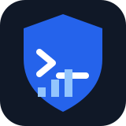

<p align="center"></p>
<h1 align="center">Auto Maintain Bench</h1>
<p align="center">A deterministic benchmark for tiny language models that diagnose and maintain Linux hosts through bash.</p>
<p align="center"><a href="README.zh-CN.md">简体中文</a> · <a href="LICENSE"></a> <a href="https://www.python.org/"></a> </p>

> **Status: closed (milestone, 2026-09-29).** The harness and scenario corpus
> reached a usable research milestone. No further development is planned; future
> work may continue in [Help Agent](https://github.com/ZisIsNotZis/helpagent),
> which may supersede this benchmark.

## ⚡ In 30 seconds

Small models are rarely tested on whether they can safely repair an operational problem. This project provides **184 deterministic Linux maintenance scenarios** across **19 categories**, runs a bash-only agent loop inside isolated Docker sandboxes, and scores observable outcomes rather than asking another model for an opinion.

It asks: *Can a small local model diagnose the host, make the smallest safe change, verify it, and stop—or escalate when it should?*

### Why this benchmark

- **Reproducible:** fixed telemetry, prompts, seed, checks, and scenario state.
- **Observable scoring:** fix **60%**, durability **20%**, safety **15%**, terminal behavior **5%**; no LLM-as-judge.
- **Safety-aware:** unexpected changes cap the maximum score at **0.20**.
- **Local-first:** the native path has **no third-party Python dependencies** and can use a local GGUF model.
- **Operationally shaped:** CPU, memory, disk, network, config, process, security, artifact, and user-request cases.

## 🚀 Quick start

Prerequisites: Python **3.10+**, Docker, and a `llama-server` binary (or compatible OpenAI-style endpoint). The checked-in `Qwen*.gguf` entries are machine-local symlinks; bring your own model files after cloning.

```bash
git clone https://github.com/ZisIsNotZis/auto_maintain_bench.git
cd auto_maintain_bench
python3 benchmark/run.py --model ./Qwen3.5-0.8B-UD-Q4_K_XL.gguf \
  --scenario CPU-001 --output /tmp/auto-maintain-cpu.json
```

The local runner starts `llama-server` and uses `local-os/default:latest` for the Docker sandbox. For an existing server:

```bash
python3 benchmark/run.py --model local-model \
  --base-url http://127.0.0.1:8080/v1 \
  --scenario CFG-001 --output /tmp/result.json
```

Run the full corpus and save trajectories:

```bash
python3 benchmark/run.py --model ./model.gguf --concurrency 4 \
  --trajectory-dir trajectories/ --version v1 --output /tmp/all.json
```

## 🧭 How it works

1. A scenario supplies bounded telemetry, a task, expected terminal behavior, checks, and an allowed-change contract.
2. The model emits exactly one bash tool call per turn; Docker executes it in an isolated sandbox.
3. The harness accepts `everything_ok` or `escalate <level> <message>` as terminal outcomes.
4. Deterministic fix, durability, safety, and terminal checks produce a score and optional trajectory JSON.
5. `MEMORY.md` is the only cross-cycle model memory in the production-loop proof of concept.

## 📁 Repository map

| Path | Purpose |
| --- | --- |
| `benchmark/run.py` | CLI benchmark entry point |
| `harness/` | prompts, contracts, loop, sandbox, scoring, and telemetry |
| `scenarios/` | 184 scenario projects in 19 categories |
| `tests/` | standard-library unit and architecture checks |
| `trajectories/` | optional model traces; large runs are local artifacts |
| `docs/` | design, rubric, catalog, ADRs, and failure analysis |
| `BENCHMARKS.md` | recorded model results and comparisons |

## 🧪 Verification and development

No package installation is required for the native test suite:

```bash
python3 -m unittest discover -s tests -p 'test_*.py' -v
```

Docker-backed tests run when Docker is available and are skipped otherwise. See [CONTRIBUTING.md](CONTRIBUTING.md) and [docs/README.md](docs/README.md).

## 🎯 Goals and non-goals

**Goals:** compare local-model maintenance behavior across runs; reward verified, minimal changes; expose failure patterns; and provide a seam for future daemon experiments.

**Non-goals:** replacing an operator, granting unrestricted host access, benchmarking general intelligence, or presenting this proof of concept as a production service.

## 🛣️ Roadmap and possible end state

- Keep scenario and scoring contracts stable while adding high-value edge cases.
- Improve local-model and existing-server adapters.
- Publish clearer cross-model reports and failure-reproduction workflows.
- Require sandboxing, approval, rollback, telemetry integrity, and durable verification before any daemon integration.

Ultimately, this could become a trusted evaluation and regression suite for an edge maintenance daemon—not an autonomous root shell.

## ⚠️ Caveats

- Results depend on model weights, quantization, prompt version, server settings, Docker image, and host resources.
- A successful score does not prove safety on an unmodeled host.
- Full runs can take **15–30 minutes** at concurrency 4 and require substantial resources.
- Linked model files are machine-local and not portable repository assets.
- `scripts/` contains workstation-specific model paths; adapt them before use.

## 🤝 Contributing

Contributions are welcome, especially deterministic scenarios with explicit validators, sandbox probes, adapters, and analysis tools. Keep tests host-safe, avoid cloud dependencies, and explain effects on score interpretation. Start with [CONTRIBUTING.md](CONTRIBUTING.md), [CODE_OF_CONDUCT.md](CODE_OF_CONDUCT.md), and [SECURITY.md](SECURITY.md).

Agents can help triage issues, reproduce failures, add deterministic scenarios, run tests, improve documentation, and implement accepted changes; maintainers review and merge the result. See [`docs/project-status.md`](docs/project-status.md) for the current classification and evidence boundary.

## Versioning

Benchmark labels such as `v12` identify optimization passes, not compatibility guarantees. Keep model, prompt, runtime, and commit metadata with every result.

## 📜 License

Licensed under [GNU GPL v3.0](LICENSE).
